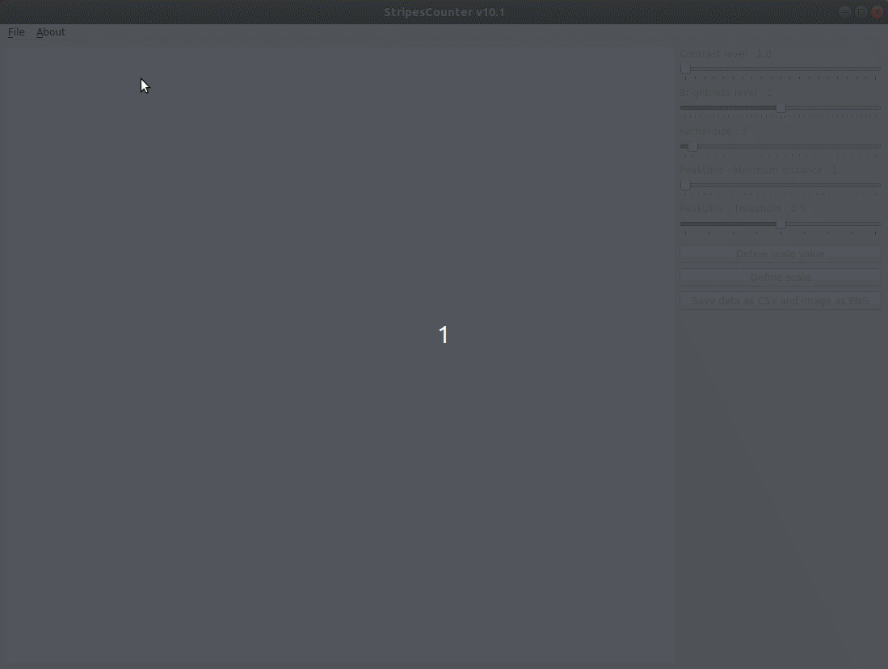

# StripesCounter

A PyQt Matplotlib python application to count stripes from microscopic images

 * Automatic detection of the scale length and scale value
 * Display of the microscopic image with a grayscale color map
 * Control of the contrast and the brightness of the image
 * Definition of a profil line from mouse double clicks
 * The profil line can be redefined, moved by picking the line or its bounds
 * Extraction of the profil
 * Smoothing (convolution) from a variable length kernel
 * Detection of the number of the peaks (number of stripes)
 * Growth rate display

  

Usage :

 * Open an image, optionnaly with a scale and value scale annotation
 * Pan the image from a mouse click
 * Zoom in or out with wheel zoom (or 2 fingers pad actions)
 * Enhance the image from brightness and contrast sliders
 * Create a profil line by double clicking
 * At the 2nd point, the profil to be extracted is drawn as a red line
 * The profil of the image is drawn corresponding to the profil line 
 * Add segments to the profil line by double clicking on it
  * left double clicking to add a control point
  * right double clicking to remove a control point 
 * Number of peaks (stripes) are counted from the smoothed profil
 * Adapt various parameters for peak dectection and smoothing
 * Move, modify the profil line and control points if needed
 * Define new scale and scale value if needed
 * Save the image and the data points, visualize the extracted profil

## Release notes

v10.1
 * Zoom and drag with mouse
 * Removed matplotlib Toolbar

v10.0
 * Profil from segmented line 

v09.4
 * Simplify events handling made now on the canvas

v09.3
 * Enforce checking errors with scaleValue and scale objects

v09.2
 * Fix for undefined variables in detectScale
 * drawProfil in a try-except block to prevent errors

v09.1
 * Fix for scale value recognition

v09.0
 * First release with a PyQt interface

## Installation

`$ git clone https://github.com/PBrockmann/StripesCounter`

Tested with python 3.8.5, matplotlib 3.4.1, pyqt 5.12.3

## Contrast and brighness reference 

https://docs.opencv.org/4.5.2/d3/dc1/tutorial_basic_linear_transform.html

## PeakUtils reference

https://peakutils.readthedocs.io/en/latest/reference.html#module-peakutils.peak

 * thres (float between [0., 1.]) – Normalized threshold. Only the peaks with amplitude higher than the threshold will be detected.

 * min_dist (int) – Minimum distance between each detected peak. The peak with the highest amplitude is preferred to satisfy this constraint.
