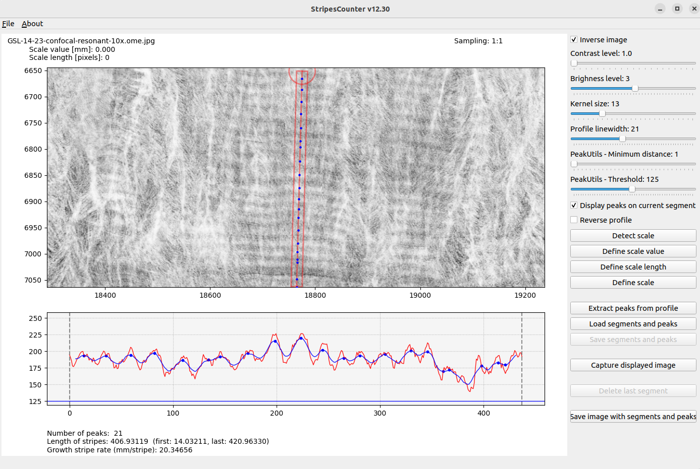
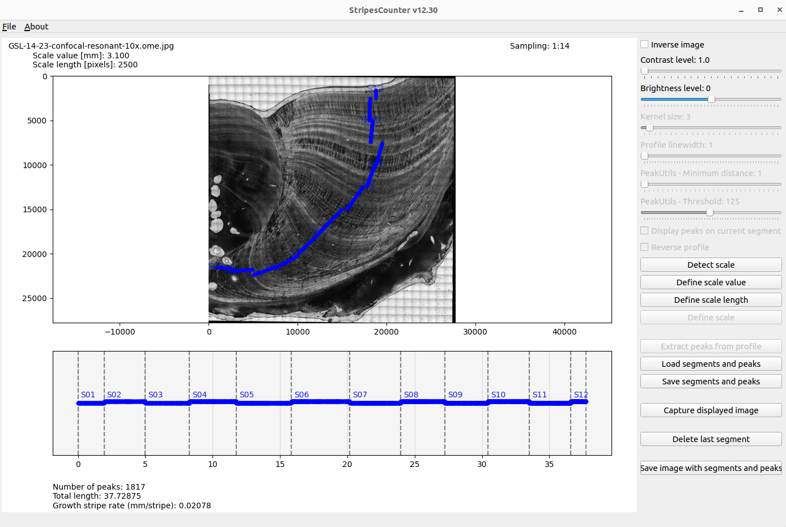

# StripesCounter

A PyQt Matplotlib python application to detect automatically peaks from multiple profile segments, edit by suppressing or adding extracted peaks and count width stripes from microscopic images.

## The StripesCounter application

### Purpose
We developed this software to address a specific need that existing market solutions either do not meet or are not well-suited for. The chosen strategy was to create an ad-hoc software tailored precisely to these requirements. The approach is relatively straightforward, featuring two main stages. The first stage involves peaks detection, where the software identifies peaks based on an image intensity profile selected by the user, with various customizable criteria such as smoothing kernel or integration width along the profile. The second stage is an editing phase, allowing users to add or delete these automatically positioned peaks from the previous step, providing maximum flexibility and precision.
The application has been designed to work seamlessly with large images (25000x25000) recorded from microscopes using progressive subsampling technology.

  

The application has a very specific scope of use. It does not offer complex image processing algorithms, only basic adjustments such as contrast, brightness, and inversion. For more advanced processing, you will need to use dedicated image processing software in a preliminary phase. Similarly, once the peaks are edited and validated by the user, their positions, scales, and distances between each peak can be saved in a spreadsheet file (CSV format), ready to be processed in a subsequent phase.

  

### Installation procedure
The application is available from a GitHub repository and consists of a python Matplotlib-based application with a PyQt interface. It is designed to run in a Conda environment, with the installation process facilitated by a requirements.txt file to ease the creation of a dedicated environment. The necessary packages to be installed include PyQt5, scikit-image, opencv-python, opencv-contrib-python, opencv-python-headless, shapely, pycairo, matplotlib, peakutils, and pandas. 
See instructions bellow for details.

### Demonstation 
  

### Usage
Here are the different steps :

* Open an image, optionnaly with a scale and value scale annotation.
* Pan the image from a mouse click.
* Zoom in or out with wheel zoom (or 2 fingers pad actions).
* Enhance the image from brightness and contrast sliders.
* Create a profile segment by double clicking to create control points.
* After the 2nd point created, the profile to be extracted is drawn as a red segment. 
* The segment can be modified (moved, shifted) by pressing the segment itself or its start or end control points.
* An intensity profile is extracted from the the image along the profile segment.
* Number of peaks are counted from the smoothed profile.
* Adapt various parameters for peaks detection and profile smoothing.
* Reverse the profile. 
* Control the width of the profile segment to integrate. 
* Inspect detected peaks with a mouse over from the image or the profile. 
* Define new scale and scale value if needed.
* Extract the peaks
* Modify the extracted peaks by clicking on peaks :
  * right click on segment to add a peak,
  * left click on a peak to delete it.
* Add a new profile segment and repeat the process.
* Extracted peaks are considered from contiguous segments. 
* Save the "peaks and stripes" in a csv file.
* Reload a saved "peaks and stripes" csv file.
* Capture the image displayed in the application.
* Save the original image with segments and peaks.

#### Release notes

* v12.30
  * Subsampling to read large images (25000x25000)
  * Remove automatic scale
* v11.82
  * Orthogonal ticks
* v11.80
  * Zoom on profile panel
  * Profile control points now created by a double click and pressing Shift key
* v11.70
  * Save in SVG not anymore PNG
* v11.60
  * Load scale length from save CSV file
  * New annotations for segments
  * Export annotations for segments in exported image
  * Fix dialog titles
* v11.50
  * New mode: multiple segments
  * Add/Delete extracted peaks
  * Ticks on segments
  * Export image with segments and peaks
  * Load/save segments and peaks
* v10.93
  * Various fixes
* v10.82
  * Smaller radius for control points
  * PeakUtils - Threshold with 0.05 increment steps
* v10.81
  * Fix with tesseract v5.0.1
  * Fix error in setting scale value
* v10.8
  * Add profil line width control
* v10.7
  * Increase precision when save files (7 digits)
* v10.6
  * Inverse image feature
  * Option to open both png and jpeg files
* v10.5
  * Scale value has now on 3 precision digits
* v10.4
  * Add extra informations (segment number, parameters) in csv file
* v10.3
  * Highlight peaks when mouse over from image or profil
* v10.2
  * Display detected peaks on image
* v10.1
  * Zoom and drag with mouse
  * Removed matplotlib Toolbar
* v10.0
  * Profil from segmented line 
* v09.4
  * Simplify events handling made now on the canvas
* v09.3
  * Enforce checking errors with scaleValue and scale objects
* v09.2
  * Fix for undefined variables in detectScale
  * drawProfil in a try-except block to prevent errors
* v09.1
  * Fix for scale value recognition
* v09.0
  * First release with a PyQt interface

#### Installation

##### Get the application
 * `git clone https://github.com/PBrockmann/StripesCounter`
 * `cd StripesCounter`

##### Create a python environment to use StripesCounter 

 * `conda create --name env_for_StripesCounter`
 * `conda env list`
 * `conda activate env_for_StripesCounter`
 * `conda install python`
 * `pip install -r requirements.txt`

##### Test
 * `python test_imports.py`
 * `python detect_scale.py BEL17-2-2_1.35x_haut0001.png`
 * `python StripesCounter_v11.py`

#### Contrast and brighness reference 

https://docs.opencv.org/4.5.4/d3/dc1/tutorial_basic_linear_transform.html

#### PeakUtils reference

https://peakutils.readthedocs.io/en/latest/reference.html#module-peakutils.peak

* `thres (float between [0., 1.])` – Normalized threshold. Only the peaks with amplitude higher than the threshold will be detected.
* `min_dist (int)` – Minimum distance between each detected peak. The peak with the highest amplitude is preferred to satisfy this constraint.
* `thres_abs (boolean)` – If True, the thres value will be interpreted as an absolute value, instead of a normalized threshold.
