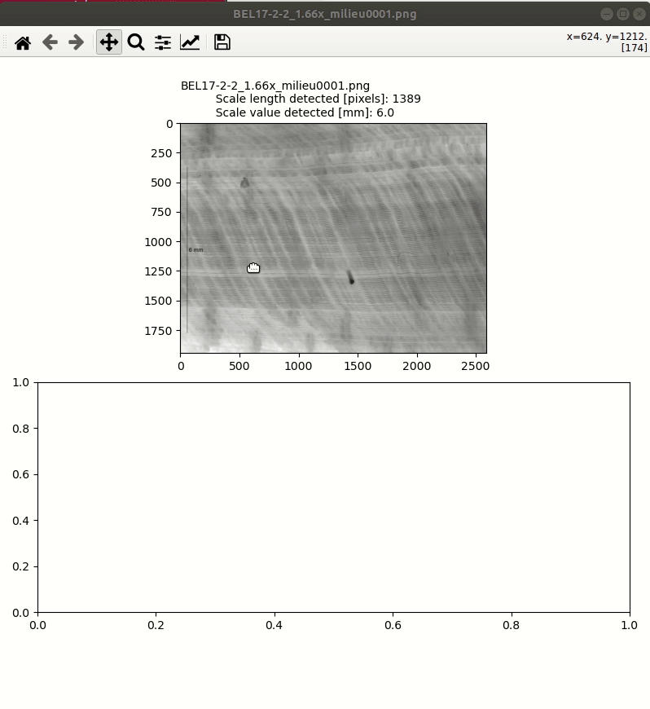

# StripesCounter

A python matplotlib script to count stripes from microscopic images.

 * Automatic detection of the scale length and scale value
 * Definition of a profil line from mouse double clicks
 * The profil line can be redefined, moved by picking the line or its bounds
 * Extraction of the profil
 * Smoothing (convolution) from a variable length kernel
 * Detection of the number of the peaks (number of stripes)
 * Growth rate display

  

### Help

Help: h
Contrast control: +/=
Brightness control: b/B
PeakUtils - Minimum distance control: z/Z
PeakUtils - Threshold control: e/E
Kernel size control: o/O
Save: S
